# OfficeFlow

> **Local-first document intelligence for messy PDFs, financial truth, and audit-ready Excel.**

OfficeFlow là workspace xử lý tài liệu tập trung vào các tình huống thực tế: PDF có text lẫn scan, invoice bị nghiêng, bảng không có đường kẻ, mô tả sản phẩm xuống nhiều dòng, bảng nối qua nhiều trang và format tiền tệ Việt Nam/quốc tế.

Thay vì biến một kết quả heuristic thành “sự thật tuyệt đối”, OfficeFlow giữ lại **raw value**, **normalized value**, **confidence**, **evidence** và **validation state**. Khi dữ liệu chưa đủ chắc chắn, hệ thống làm rõ điều đó và đưa phần cần xác minh vào human review.

<p align="center">
  <a href="#quick-start"><strong>Quick start</strong></a>
  ·
  <a href="#kiến-trúc"><strong>Architecture</strong></a>
  ·
  <a href="#document-brain"><strong>Document Brain</strong></a>
  ·
  <a href="#quality-gates"><strong>Quality gates</strong></a>
</p>

<p align="center">
  
  
  
  
  
</p>

---

## Executive summary

OfficeFlow biến các workflow PDF và Office lặp đi lặp lại thành một workspace local-first có thể kiểm tra được:

```text
source document
  → validation & fingerprint
  → page profiling
  → native extraction / local OCR
  → preprocessing & deskew
  → layout and table reconstruction
  → semantic entities and invoice KVP
  → truth model and provenance
  → arithmetic validation
  → human review when required
  → structured workbook or converted document
```

### Vì sao OfficeFlow khác biệt?

| Trụ cột | Ý nghĩa trong hệ thống |
|---|---|
| **Local-first** | Xử lý tài liệu bằng các thành phần local như Tesseract, OpenCV, NumPy, Pillow và deterministic heuristics. Không bắt buộc paid LLM API. |
| **Evidence-first** | Observation quan trọng có thể truy ngược về page, block, table, cell, bounding box và source quote. |
| **Conservative inference** | Chỉ merge, normalize hoặc suy luận khi có đủ structural và semantic evidence. |
| **Raw value preservation** | Giá trị gốc không bị ghi đè bởi giá trị đã chuẩn hóa hoặc giá trị do reviewer xác minh. |
| **Explicit uncertainty** | Confidence thấp, conflict và review requirement được thể hiện rõ thay vì bị che giấu. |
| **Replaceable adapters** | OCR và document processor đi qua contract riêng, giúp mở rộng engine mà không phá vỡ canonical model. |

> **Nguyên tắc cốt lõi:** một kết quả dễ kiểm tra và biết rõ giới hạn có giá trị hơn một kết quả “trông có vẻ đúng” nhưng không giải thích được nguồn gốc.

## Capability map

### Đã triển khai

| Capability | Phạm vi |
|---|---|
| PDF workflows | Merge, split, compress, rotate, extract/delete pages và render PDF thành ảnh. |
| Office conversion | PDF ↔ Word ở các workflow được hỗ trợ, Excel/PowerPoint/ảnh sang PDF. |
| Native PDF extraction | Ưu tiên text/table layer có sẵn để giữ tốc độ và độ chính xác. |
| Local OCR fallback | Tesseract adapter, language code, page-aware routing và pass selection. |
| Image preprocessing | Deskew và preprocessing trước OCR khi tài liệu có chất lượng kém. |
| Table reconstruction | Chuẩn hóa rows, xử lý borderless alignment và lọc repeated header. |
| Multi-line row inference | Gom các fragment mô tả thành một logical line item có text wrapping. |
| Invoice KVP extraction | Invoice number, date, tax code, VAT rate, subtotal và grand total. |
| Financial localization | Parse các convention như `1.000.000 VNĐ`, `1,000,000.00` và `1.234,56 €`. |
| Arithmetic validation | Kiểm tra quantity × unit price, subtotal + VAT và grand total consistency. |
| Truth & provenance | Raw/normalized values, confidence, evidence, facts và graph edges. |
| Job lifecycle | Upload validation, status polling, artifact download, SQLite job metadata và readiness checks. |
| Frontend workspace | Vue interface cho upload, tool selection, processing state, history và confidence review panel. |

### Đang hoàn thiện hoặc chưa production-ready

Các capability dưới đây có hướng triển khai rõ ràng nhưng **không được xem là đã hoàn thiện**:

| Area | Trạng thái hiện tại |
|---|---|
| Identity & authorization | Chưa có ownership enforcement hoàn chỉnh cho từng job/artifact. |
| Durable production persistence | SQLite phù hợp cho local/test; PostgreSQL schema và migration lifecycle còn tiếp tục hoàn thiện. |
| Queue recovery | Docker Compose có Redis/Celery worker, nhưng execution contract hiện vẫn cần harden thêm cho retry, lease và recovery. |
| Review workspace | Backend review contract và warning metadata đã có; UI chỉnh sửa có traceability còn tiếp tục phát triển. |
| Benchmarking | Có regression fixtures và benchmark scaffold; chưa có labeled corpus đại diện đủ rộng để công bố accuracy. |
| Complex tables | Merged cells, hierarchical headers và bảng thiếu header ở trang tiếp theo vẫn có thể cần review thủ công. |

## Document Brain

### 1. PDF → Excel có provenance

Pipeline PDF-to-Excel không chỉ xuất một bảng phẳng. Workbook được tổ chức để người dùng có thể xem kết quả và quay lại evidence:

| Sheet | Nội dung |
|---|---|
| `Overview` | File summary, page count, OCR status và invoice metadata kèm confidence/evidence. |
| `Line Items` | Invoice table với multiline description đã được collapse và `wrap_text=True`. |
| `Audit` | Facts, graph edges, cell evidence, validation result, confidence và review tasks. |
| `Document Text` | Text theo page/line khi bật tùy chọn tương ứng. |
| `Page ...` | Bảng phát hiện theo từng page để giữ khả năng đối chiếu source. |

Một audit record điển hình có cấu trúc tương tự:

```json
{
  "kind": "cell",
  "page": 1,
  "object_id": "p1-t1-r4-c5",
  "raw_value": "1.100.000 VNĐ",
  "normalized_value": 1100000,
  "confidence": 0.94,
  "engine": "invoice-kvp-regex",
  "evidence": {
    "bbox": [420, 318, 520, 340],
    "quote": "Grand Total: 1.100.000 VNĐ"
  }
}
```

### 2. Multi-line row inference

Mô tả sản phẩm có thể chiếm nhiều visual lines trong khi quantity, unit price và total chỉ xuất hiện trên một line. OfficeFlow sử dụng:

1. **Y-axis clustering** để gom các text fragment gần nhau theo vertical overlap và adaptive line tolerance.
2. **Continuation-row inference** để nối dòng tiếp theo vào logical row trước đó khi dòng mới chỉ còn description và các cột số rỗng.
3. **Wrapped workbook output** để giữ description trong một row duy nhất mà không làm mất nội dung nguồn.

### 3. Invoice entities và financial localization

Các metadata nằm ngoài table được trích xuất bằng deterministic rules và giữ spatial provenance:

| Entity | Ví dụ | Normalization |
|---|---|---|
| `Invoice_Number` | `INV-2026-001` | Chuỗi mã hóa đơn |
| `Date` | `09/09/2026` | ISO date khi parse được |
| `Tax_Code` | `MST: 0312345678` | Chỉ giữ chữ số |
| `VAT_Rate` | `VAT: 10%` | Fraction, ví dụ `0.10` |
| `Subtotal` | `1.000.000 VNĐ` | Numeric financial value |
| `Grand_Total` | `1.100.000 VNĐ` | Numeric financial value |

Khi invoice thiếu VAT rate nhưng có subtotal và grand total, engine có thể tạo một inference có điều kiện:

```text
inferred_vat_rate = grand_total / subtotal - 1
```

Inference chỉ được chấp nhận trong khoảng hợp lý và luôn được kiểm tra lại bằng quan hệ:

```text
subtotal + (subtotal × vat_rate) ≈ grand_total
```

### 4. Truth model và human review

Khi arithmetic check thất bại, hệ thống không tự ý sửa raw source value. Thay vào đó, pipeline:

1. Tạo `ValidationResult` với trạng thái `invalid`.
2. Tạo `ReviewTask` với reason `arithmetic_conflict`.
3. Đặt priority phù hợp, trong đó conflict tài chính được ưu tiên cao.
4. Gắn evidence của cell hoặc quan hệ tài chính.
5. Đánh dấu truth facts là `conflicting`.
6. Hiển thị cảnh báo qua `ConfidenceReviewPanel.vue`.

## Kiến trúc

```mermaid
flowchart LR
    U[Upload] --> V[Validation + fingerprint]
    V --> P[Page profile + quality signals]
    P --> N[Native extraction]
    P --> O[Local OCR fallback]
    O --> D[Deskew + preprocessing]
    N --> C[CanonicalDocument]
    D --> C
    C --> L[Layout + table inference]
    L --> S[Semantic entities + KVP]
    S --> T[Truth model + provenance]
    T --> A[Arithmetic validation]
    A --> R{Review required?}
    R -->|Yes| H[Human review panel]
    R -->|No| X[Workbook export]
    H --> X
    X --> W[Overview + Line Items + Audit]
```



### Repository layers

| Layer | Responsibility |
|---|---|
| `frontend/` | Vue 3 + Vite workspace, upload flow, tool catalog, history và review UI. |
| `backend/app/api/` | FastAPI routes, multipart upload, job lifecycle và artifact download. |
| `backend/app/document_ai/` | Canonical document model, profiling, routing, semantics, truth và validation. |
| `backend/app/processors/` | PDF/Office/image processors và Excel export. |
| `backend/app/persistence/` | SQLite job metadata, database models và health checks. |
| `backend/app/queue.py` | Redis/Celery integration cho deployment stack. |
| `backend/tests/` | Regression tests, layout resilience, financial validation và benchmark scaffold. |

## Tool catalog

| Category | Available workflows |
|---|---|
| **PDF** | PDF to Excel, merge, split, compress, rotate, PDF to JPG, extract pages, delete pages. |
| **Office** | PDF to Word, Word to PDF, Excel to PDF, PowerPoint to PDF. |
| **Images** | Images to PDF và image conversion. |

## Quick start

### Requirements

- Python 3.11+
- Node.js 22+
- Tesseract OCR
- `tesseract-ocr-eng` và `tesseract-ocr-vie` nếu cần xử lý tài liệu tiếng Anh/Việt
- PostgreSQL và Redis chỉ bắt buộc khi chạy deployment stack đầy đủ

### 1. Clone repository

```bash
git clone https://github.com/LuongNuong131/LuNu_WPS.git
cd LuNu_WPS
```

### 2. Cài system dependencies

Trên Ubuntu/Debian:

```bash
sudo apt-get update
sudo apt-get install -y \
  tesseract-ocr \
  tesseract-ocr-eng \
  tesseract-ocr-vie
```

### 3. Cài và chạy backend

```bash
python3 -m venv .venv
source .venv/bin/activate
pip install -r backend/requirements.txt

PYTHONPATH=backend uvicorn main:app \
  --app-dir backend \
  --reload \
  --host 127.0.0.1 \
  --port 8000
```

Backend local endpoints:

| Endpoint | Mục đích |
|---|---|
| `http://localhost:8000/docs` | FastAPI interactive API documentation |
| `http://localhost:8000/health` | Liveness check |
| `http://localhost:8000/health/ready` | Readiness và storage/database check |

### 4. Cài và chạy frontend

Mở terminal thứ hai:

```bash
cd frontend
npm ci
npm run dev
```

Frontend mặc định chạy tại `http://localhost:5173`.

## Docker Compose

### Khởi động full stack

```bash
cp .env.example .env
```

Mở `.env` và đặt `JWT_SECRET_KEY` thành một secret ngẫu nhiên tối thiểu 32 bytes. Sau đó:

```bash
docker compose up --build -d
docker compose ps
docker compose logs -f backend worker
```

### Services

| Service | Vai trò | Exposure mặc định |
|---|---|---|
| `frontend` | Vue production build và Nginx reverse proxy | `http://localhost/` |
| `backend` | FastAPI API và health endpoints | `http://localhost:8000` |
| `worker` | Celery document processing runtime | Internal |
| `postgres` | Relational database cho deployment stack | Internal `5432` |
| `redis` | Celery broker/backend | Internal `6379` |

### Production checklist

- Bật `AUTH_REQUIRED=true`.
- Dùng `JWT_SECRET_KEY` khác nhau ở từng môi trường.
- Đưa secrets vào secret manager; không commit `.env`.
- Thiết lập authorization và ownership trước khi expose artifact download ra môi trường không tin cậy.
- Dùng PostgreSQL/Redis managed service nếu cần high availability.
- Thiết lập cleanup/TTL cho output artifacts.
- Thay local/in-memory rate limiting bằng distributed limiter khi scale nhiều instance.
- Giám sát JSON logs theo `job_id` và `document_id`.
- Đánh giá lại retention policy trước khi đưa tài liệu nhạy cảm vào hệ thống.

## Configuration

Các biến quan trọng:

| Variable | Default | Mục đích |
|---|---|---|
| `DATABASE_URL` | empty | Database backend; local SQLite được dùng khi không cấu hình database ngoài. |
| `REDIS_URL` | empty | Bật Redis/Celery integration khi có Redis URL. |
| `JWT_SECRET_KEY` | development placeholder | Secret ký JWT; phải thay khi deploy. |
| `AUTH_REQUIRED` | `false` | Bật authentication enforcement. |
| `LOG_LEVEL` | `INFO` | Mức JSON logging. |
| `JOB_DB_PATH` | `backend/storage/jobs.sqlite3` | Đường dẫn SQLite local cho job metadata. |

## Quality gates

Chạy các lệnh sau trước mỗi pull request hoặc deployment:

```bash
# Python syntax
PYTHONPATH=backend python3 -m compileall -q backend

# Backend regression suite
PYTHONPATH=backend python3 -m pytest -q

# Frontend type-check + production build
cd frontend
npm run build

# Back to repository root
cd ..
git diff --check

# Compose configuration validation; requires Docker CLI
docker compose config
```

Regression coverage hiện tập trung vào:

- Native PDF extraction.
- Image-only PDF và OCR fallback.
- Deskew preprocessing.
- Borderless column clustering.
- Headerless hoặc repeated-header multi-page continuation.
- Multi-line invoice descriptions.
- Typed Excel values.
- KVP metadata và provenance bounding box.
- Vietnamese/international money parsing.
- VAT validation và VAT rate inference.
- Arithmetic conflict review.
- API options validation.
- Workbook structure và audit metadata.

## Data contract, privacy và giới hạn

OfficeFlow được thiết kế cho **traceability**, không phải để đưa ra cam kết accuracy tuyệt đối trên mọi loại tài liệu.

- Raw extraction không bị overwrite bởi normalized hoặc verified value.
- Evidence có thể chứa quote, bounding box, page, block ID, table ID và cell ID.
- Verified value được lưu tách biệt với observation ban đầu.
- Input tạm được lưu trong job directory và dọn sau khi xử lý theo lifecycle hiện tại.
- Output thành công cần policy cleanup/TTL riêng khi deploy lâu dài.
- Upload mặc định giới hạn 25 MB mỗi file và tối đa 10 file.
- OCR và table reconstruction là heuristic; scan mờ, handwriting, chart, merged cells phức tạp hoặc layout bất thường có thể cần review.
- SHA-256 fingerprint chỉ là identity/deduplication aid nội bộ, không phải encryption.
- Không đưa tài liệu nhạy cảm vào môi trường chưa bật authentication, authorization và storage policy phù hợp.
- Chưa nên gọi hệ thống là production-ready cho workload multi-tenant trước khi hoàn thiện identity, ownership, durable persistence và artifact lifecycle.

## Project status

Repository hiện ở giai đoạn **active development**. Document Brain cho PDF → Excel đã được triển khai thực tế ở mức local-first; các lớp identity, production persistence, durable execution, benchmark corpus và review workspace vẫn đang được harden theo từng milestone.

### Roadmap

| Horizon | Direction | Mục tiêu |
|---|---|---|
| Near term | OCR adapter expansion | Thêm adapter local như PaddleOCR/EasyOCR mà không đổi canonical contract. |
| Near term | Document benchmark | Mở rộng invoice corpus có ground truth và đo precision/recall theo field. |
| Mid term | Durable storage | Hoàn thiện PostgreSQL job store, artifact storage và cleanup lifecycle. |
| Mid term | Restartable execution | Bổ sung idempotency, leases, retry semantics và worker recovery. |
| Mid term | Workspace and review | Expose persisted documents, evidence và review tasks với authorization. |
| Long term | Table boundary learning | Kết hợp proposal model local với deterministic validation và provenance. |
| Long term | Multi-document intelligence | Reconciliation, duplicate invoice detection và supplier-level analytics. |

Những capability chưa được triển khai hoàn chỉnh sẽ không được giả lập trong UI hoặc mô tả như đã production-ready.

## Contributing

Đóng góp được chào đón. Một thay đổi chất lượng nên:

1. Tạo branch riêng cho feature hoặc fix.
2. Bổ sung regression test cho edge case mới.
3. Giữ nguyên raw value và evidence contract, trừ khi thay đổi contract đã được thảo luận rõ.
4. Chạy toàn bộ quality gates.
5. Dùng commit message phản ánh đúng module và hành vi thay đổi.

```bash
git checkout -b feat/new-invoice-heuristic
PYTHONPATH=backend python3 -m pytest -q
cd frontend && npm run build
```

## License

Repository hiện chưa khai báo một license file chính thức. Trước khi phân phối hoặc sử dụng trong sản phẩm thương mại, hãy bổ sung và công bố điều khoản license phù hợp.

## References

[1]: ARCHITECTURE_AUDIT.md "OfficeFlow architecture audit and implementation status"
[2]: PDF_EXCEL_GAP_MATRIX.md "PDF to Excel capability and gap matrix"
[3]: TECHNICAL_DEBT.md "OfficeFlow technical debt register"
[4]: backend/app/document_ai/pipeline.py "Canonical document processing pipeline"
[5]: backend/app/processors/pdf_to_excel.py "PDF to Excel processor and workbook export"

---

<p align="center">
  <strong>Built for messy documents. Designed for traceable decisions.</strong>
</p>

<p align="center">
  <a href="https://github.com/LuongNuong131/LuNu_WPS">View the repository</a>
</p>

<!-- OfficeFlow | README maintained alongside the implementation. -->
