# OfficeFlow

> **Local-first document intelligence for messy PDFs, financial truth, and audit-ready Excel.**

OfficeFlow biến các PDF đời thực thành workbook có cấu trúc mà người dùng có thể **kiểm tra, truy vết và tin cậy có điều kiện**. Dự án được thiết kế cho invoice scan bị nghiêng, bảng không có đường kẻ, mô tả sản phẩm xuống nhiều dòng, bảng nối qua nhiều trang và format tiền tệ Việt Nam/quốc tế.

<p align="center">
  <a href="https://github.com/LuongNuong131/LuNu_WPS"><strong>Repository</strong></a>
  ·
  <a href="#quick-start"><strong>Quick start</strong></a>
  ·
  <a href="#kiến-trúc"><strong>Architecture</strong></a>
  ·
  <a href="#enterprise-invoice-engine"><strong>Invoice engine</strong></a>
</p>

<p align="center">
  
  
  
  
  
</p>

---

## Tóm tắt trong 30 giây

**OfficeFlow không chỉ đọc PDF.** Nó xây dựng một chuỗi bằng chứng từ source document đến Excel output:

```text
raw document
  → page profile
  → native extraction / local OCR
  → deskew + layout inference
  → table reconstruction
  → invoice entities
  → truth model + evidence
  → arithmetic validation
  → human review when needed
  → audit-ready workbook
```

Điểm khác biệt cốt lõi là hệ thống **không biến một heuristic thành sự thật tuyệt đối**. Raw value được giữ nguyên, confidence được công khai, conflict được gắn vào cell và reviewer luôn có thể quay lại evidence gốc.

## Mục lục

- [Tóm tắt trong 30 giây](#tóm-tắt-trong-30-giây)
- [Tại sao dự án tồn tại](#tại-sao-dự-án-tồn-tại)
- [Capability map](#capability-map)
- [Enterprise invoice engine](#enterprise-invoice-engine)
- [Workbook output](#workbook-output)
- [Kiến trúc](#kiến-trúc)
- [Quick start](#quick-start)
- [Production với Docker Compose](#production-với-docker-compose)
- [Quality gates](#quality-gates)
- [Data contract, privacy và giới hạn](#data-contract-privacy-và-giới-hạn)
- [Cấu trúc repository](#cấu-trúc-repository)
- [Roadmap](#roadmap)
- [Đóng góp](#đóng-góp)
- [License](#license)

## Tại sao dự án tồn tại?

Các workflow PDF → Excel thường hoạt động tốt trên tài liệu demo nhưng suy giảm nhanh khi gặp tài liệu thực tế. Một invoice có thể chứa text native lẫn scan image, góc chụp lệch, cột không thẳng tuyệt đối, mô tả sản phẩm bị wrap và số tiền dùng convention khác nhau giữa Việt Nam và quốc tế.

OfficeFlow tập trung giải quyết phần khó nhất của bài toán: **document entropy**. Thay vì chỉ tối ưu cho một mẫu PDF, pipeline đưa ra quyết định có điều kiện, lưu diagnostics và đẩy các trường không chắc chắn vào human review.

## Capability map

| Capability | Status | Mô tả |
|---|:---:|---|
| PDF/Office workflows | ✅ | Merge, split, compress, rotate, convert và các workflow tài liệu phổ biến. |
| Native PDF extraction | ✅ | Ưu tiên text/table layer có sẵn để giữ độ chính xác và tốc độ. |
| Local OCR fallback | ✅ | Tesseract adapter, nhiều language code, page-aware OCR và pass selection. |
| Deskew & preprocessing | ✅ | Phát hiện góc nghiêng nhỏ bằng OpenCV trước khi OCR. |
| Borderless table inference | ✅ | Density clustering cho alignment bị nhiễu. |
| Multi-page continuation | ✅ | Merge bảng liền trang bằng header, column-width vector và data-type evidence. |
| Multi-line row inference | ✅ | Gom các fragment mô tả thành một logical line item với text wrapping. |
| Invoice KVP extraction | ✅ | Invoice number, date, MST/tax code, VAT rate, subtotal và grand total. |
| Financial localization | ✅ | Parse `1.000.000 VNĐ`, `1,000,000.00`, `1.234,56 €` và các biến thể tương tự. |
| Arithmetic validation | ✅ | Quantity × Unit Price, subtotal + VAT và grand total consistency checks. |
| Truth & provenance | ✅ | Raw value, normalized value, confidence, evidence, facts và graph edges. |
| Human review | ✅ | Review task cấp entity/cell, conflict flag và verified value tách biệt. |
| Durable processing | ✅ | Celery + Redis, late acknowledgement, retry backoff và worker observability. |
| Production stack | ✅ | FastAPI, Vue/Nginx, PostgreSQL, Redis và Celery trong Docker Compose. |
| Structured logging | ✅ | JSON logs có job ID, document ID, retry count và stack trace. |

## Enterprise invoice engine

### 1. Multi-line row inference

Mô tả sản phẩm thường chiếm nhiều visual lines trong khi quantity, unit price và total chỉ xuất hiện trên một line. OfficeFlow xử lý bằng hai lớp heuristic:

- **Y-axis clustering:** gom các text fragment gần nhau theo vertical overlap và adaptive line tolerance.
- **Continuation-row inference:** nếu dòng tiếp theo chỉ chứa description và các cột số rỗng, description được nối vào logical row trước đó bằng newline.

Excel giữ description trong một row duy nhất và bật `wrap_text=True`. Cách này tránh tạo ra ba item giả hoặc dùng vertical merge làm mất dữ liệu.

### 2. Invoice KVP extraction

Các metadata nằm ngoài table được trích xuất bằng regex deterministic trên block text, đồng thời giữ spatial provenance:

| Entity | Ví dụ | Normalization |
|---|---|---|
| `Invoice_Number` | `INV-2026-001` | Chuỗi mã hóa đơn |
| `Date` | `09/09/2026` | ISO date khi parse được |
| `Tax_Code` | `MST: 0312345678` | Chỉ giữ chữ số |
| `VAT_Rate` | `VAT: 10%` | Fraction, ví dụ `0.10` |
| `Subtotal` | `1.000.000 VNĐ` | Numeric financial value |
| `Grand_Total` | `1.100.000 VNĐ` | Numeric financial value |

Mỗi entity giữ `raw_value`, `normalized_value`, `confidence`, `block_id`, `bbox`, `quote` và engine provenance.

### 3. Vietnamese financial localization

Financial parser dùng context analysis thay vì giả định một convention duy nhất:

```text
1.000.000 VNĐ  → 1000000
1,000,000.00   → 1000000
1.234,56 €     → 1234.56
```

Khi invoice có subtotal và grand total nhưng thiếu VAT rate, engine có thể suy luận:

```text
inferred_vat_rate = grand_total / subtotal - 1
```

Rate chỉ được chấp nhận trong khoảng hợp lý. Kết quả được lưu trong diagnostics và được validation lại bằng quan hệ:

```text
subtotal + (subtotal × vat_rate) ≈ grand_total
```

### 4. Financial truth và human review

Khi arithmetic check thất bại, hệ thống không sửa raw source value. Thay vào đó, nó:

1. Tạo `ValidationResult` với trạng thái `invalid`.
2. Tạo `ReviewTask` với reason `arithmetic_conflict`.
3. Đặt priority `high`.
4. Gắn evidence của cell hoặc quan hệ tài chính.
5. Đánh dấu truth facts là `conflicting`.
6. Hiển thị cảnh báo nổi bật trong `ConfidenceReviewPanel.vue`.

## Workbook output

Với invoice processing, workbook được tổ chức theo nghiệp vụ:

| Sheet | Nội dung |
|---|---|
| `Overview` | File summary, page count, OCR status và invoice metadata với confidence/evidence. |
| `Line Items` | Bảng invoice chính, multiline description đã được collapse và text wrap. |
| `Audit` | Facts, graph edges, cell evidence, validation result, confidence và review tasks. |
| `Document Text` | Toàn bộ text theo page/line khi được bật. |
| `Page ...` | Các bảng được phát hiện riêng lẻ để giữ khả năng kiểm tra nguồn. |

Ví dụ audit record có thể được hiểu như sau:

```json
{
  "kind": "cell",
  "page": 1,
  "object_id": "p1-t1-r4-c5",
  "raw_value": "1.100.000 VNĐ",
  "confidence": 0.94,
  "engine": "invoice-kvp-regex",
  "evidence": {
    "bbox": [420, 318, 520, 340],
    "quote": "Grand Total: 1.100.000 VNĐ"
  }
}
```

## Kiến trúc

```mermaid
flowchart LR
    U[Upload] --> V[Validation + fingerprint]
    V --> P[Page profile + quality signals]
    P --> N[Native extraction]
    P --> O[Local OCR fallback]
    O --> D[Deskew + preprocessing]
    N --> C[CanonicalDocument]
    D --> C
    C --> L[Layout + table inference]
    L --> S[Semantic entities + KVP]
    S --> T[Truth model + provenance]
    T --> A[Arithmetic validation]
    A --> R{Review required?}
    R -->|Yes| H[Human review panel]
    R -->|No| X[Workbook export]
    H --> X
    X --> W[Overview + Line Items + Audit]
```



### Core design principles

| Principle | Implementation |
|---|---|
| Local-first | OpenCV, NumPy, Pillow, Tesseract và deterministic heuristics; không phụ thuộc paid LLM API. |
| Evidence-first | Mọi observation quan trọng có thể truy ngược về page/block/table/cell. |
| Conservative inference | Chỉ merge hoặc normalize khi đủ structural/semantic evidence. |
| Raw value preservation | Normalized value không ghi đè raw source value. |
| Explicit uncertainty | `uncertain`, `conflicting`, warning và review task được giữ trong output. |
| Replaceable adapters | OCR engine và processor được tách qua adapter/contract để có thể mở rộng. |

## Quick start

### Yêu cầu

- Python 3.11+
- Node.js 22+
- Tesseract OCR
- PostgreSQL và Redis chỉ cần khi dùng durable queue hoặc production stack

### 1. Cài system dependencies

Ubuntu/Debian:

```bash
sudo apt-get update
sudo apt-get install -y \
  tesseract-ocr \
  tesseract-ocr-eng \
  tesseract-ocr-vie
```

### 2. Cài backend dependencies

```bash
python3 -m venv .venv
source .venv/bin/activate
pip install -r backend/requirements.txt
```

### 3. Chạy backend

```bash
PYTHONPATH=backend uvicorn main:app \
  --app-dir backend \
  --reload \
  --host 127.0.0.1 \
  --port 8000
```

Backend endpoints:

- API docs: `http://localhost:8000/docs`
- Liveness: `http://localhost:8000/health`
- Readiness: `http://localhost:8000/health/ready`

### 4. Chạy frontend

Mở terminal thứ hai:

```bash
cd frontend
npm ci
npm run dev
```

Frontend mặc định chạy tại `http://localhost:5173`.

## Production với Docker Compose

### Khởi động toàn bộ stack

```bash
cp .env.example .env
```

Đặt `JWT_SECRET_KEY` trong `.env` thành một secret ngẫu nhiên tối thiểu 32 bytes, sau đó:

```bash
docker compose up --build -d
docker compose ps
docker compose logs -f backend worker
```

### Services

| Service | Vai trò | Exposure mặc định |
|---|---|---|
| `frontend` | Vue production build + Nginx reverse proxy | `http://localhost/` |
| `backend` | FastAPI API và health endpoints | `http://localhost:8000` |
| `worker` | Celery document processing | Internal |
| `postgres` | Durable relational database | Internal `5432` |
| `redis` | Celery broker/backend | Internal `6379` |

### Production checklist

- Bật `AUTH_REQUIRED=true`.
- Dùng `JWT_SECRET_KEY` khác nhau ở từng môi trường.
- Đưa secrets vào secret manager, không commit `.env`.
- Dùng PostgreSQL/Redis managed service nếu cần high availability.
- Thiết lập cleanup/TTL cho output artifacts.
- Thay in-memory/local rate limiting bằng distributed limiter khi scale nhiều instance.
- Giám sát JSON logs theo `job_id` và `document_id`.

## Configuration

Các biến quan trọng:

| Variable | Default | Mục đích |
|---|---|---|
| `DATABASE_URL` | empty | Database backend; local SQLite vẫn được hỗ trợ cho regression/local mode. |
| `REDIS_URL` | empty | Bật Celery queue khi có Redis URL. |
| `JWT_SECRET_KEY` | development placeholder | Secret ký JWT; phải thay khi deploy. |
| `AUTH_REQUIRED` | `false` | Bật authentication enforcement trong production. |
| `LOG_LEVEL` | `INFO` | Mức JSON logging. |
| `JOB_DB_PATH` | `backend/storage/jobs.sqlite3` | Đường dẫn SQLite local khi không dùng durable database. |

## Quality gates

Chạy trước mỗi pull request hoặc production deployment:

```bash
# Python syntax
PYTHONPATH=backend python3 -m compileall -q backend

# Backend regression suite
PYTHONPATH=backend python3 -m pytest -q

# Frontend type-check + production build
cd frontend
npm run build

# Back to repository root
cd ..
git diff --check

# Compose YAML/schema check
# Requires Docker CLI
docker compose config
```

Test suite hiện bao phủ:

- Native PDF extraction.
- Image-only PDF và OCR fallback.
- Deskew preprocessing.
- Borderless column clustering.
- Headerless multi-page continuation.
- Multi-line invoice descriptions.
- Typed Excel values.
- KVP metadata và provenance bbox.
- Vietnamese/international money parsing.
- VAT validation và VAT rate inference.
- Arithmetic conflict review.
- API options validation.
- Workbook structure và audit metadata.

## Data contract, privacy và giới hạn

OfficeFlow được thiết kế để audit, không phải để đưa ra cam kết accuracy tuyệt đối.

- Raw extraction không bị overwrite bởi normalized hoặc verified value.
- Evidence có thể chứa quote, bbox, page, block ID, table ID và cell ID.
- Review task lưu verified value tách biệt với observation ban đầu.
- Input tạm được lưu trong job directory và dọn sau khi xử lý.
- Output thành công cần policy cleanup/TTL riêng khi deploy lâu dài.
- Upload mặc định giới hạn 25 MB mỗi file và tối đa 10 file.
- OCR và table reconstruction là heuristic; scan mờ, handwriting, chart, merged cells phức tạp hoặc layout bất thường có thể cần review.
- Không đưa tài liệu nhạy cảm vào môi trường chưa bật authentication, authorization và storage policy phù hợp.
- SHA-256 fingerprint là identity/deduplication aid nội bộ, không phải encryption.

## Cấu trúc repository

```text
.
├── backend/
│   ├── app/
│   │   ├── api/                    # FastAPI routes và job lifecycle
│   │   ├── core/                   # settings và structured logging
│   │   ├── document_ai/
│   │   │   ├── layout/             # spans, clustering, multiline rows
│   │   │   ├── ocr/                # OCR adapter và Tesseract engine
│   │   │   ├── preprocess/         # deskew, denoise, contrast
│   │   │   ├── semantics.py        # entities, KVP và money parser
│   │   │   ├── truth.py            # facts, graph edges, truth states
│   │   │   └── validation.py       # arithmetic, VAT và review tasks
│   │   ├── processors/             # PDF/Office processors và Excel export
│   │   ├── queue.py                # Celery/Redis integration
│   │   └── worker.py               # retry/backoff và worker logs
│   ├── tests/                      # regression và benchmark tests
│   ├── Dockerfile
│   └── requirements.txt
├── frontend/
│   ├── src/components/review/      # confidence + financial conflict UI
│   ├── src/views/                  # workflow screens
│   ├── Dockerfile
│   └── nginx.conf
├── docker-compose.yml
├── .env.example
├── ARCHITECTURE_AUDIT.md
├── PDF_EXCEL_GAP_MATRIX.md
├── TECHNICAL_DEBT.md
└── README.md
```

## Roadmap

| Horizon | Direction | Mục tiêu |
|---|---|---|
| Near term | OCR adapter expansion | Thêm PaddleOCR/EasyOCR adapter local mà không đổi canonical contract. |
| Near term | Document benchmark | Mở rộng corpus invoice có ground truth và đo precision/recall theo field. |
| Mid term | Durable storage | Hoàn thiện PostgreSQL job store, artifact storage và cleanup lifecycle. |
| Mid term | Distributed operations | Distributed rate limiting, metrics, tracing và worker autoscaling. |
| Long term | Table boundary learning | Kết hợp proposal model local với deterministic validation và provenance. |
| Long term | Multi-document intelligence | Reconciliation, duplicate invoice detection và supplier-level analytics. |

Những capability chưa được triển khai hoàn chỉnh sẽ không được giả lập trong UI hoặc mô tả như đã production-ready.

## Đóng góp

1. Tạo branch riêng cho thay đổi.
2. Thêm regression test cho edge case mới.
3. Giữ raw value và evidence contract không bị phá vỡ.
4. Chạy toàn bộ quality gates.
5. Dùng commit message mô tả đúng module thay đổi.

Ví dụ:

```bash
git checkout -b feat/new-invoice-heuristic
PYTHONPATH=backend python3 -m pytest -q
cd frontend && npm run build
```

## License

OfficeFlow hiện được phát triển theo hướng cộng đồng và local/open-source-first. Hãy bổ sung file license chính thức vào repository khi chốt điều khoản phân phối.

---

<p align="center">
  <strong>Built for messy documents. Designed for traceable decisions.</strong>
</p>
